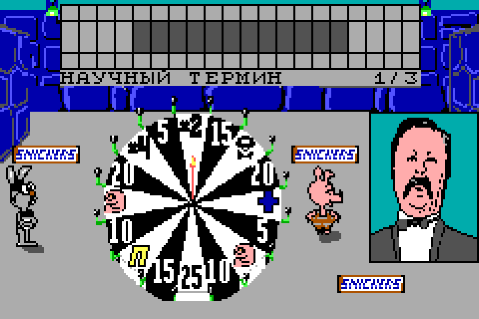

# «Поле чудес» для Game Boy Advance

Порт DOS-игры Димы Башурова на Game Boy Advance. Оригинальные персонажи, графика, база слов и звук PC Speaker; три раунда, призы и сохранение рекордов.

Опубликованная версия **1.1**: единое меню и пауза по START, краткая справка на одном экране, полное отключение звука по L со значком динамика. Возвращён выбор «Скажу слово / Кручу барабан», открытые буквы закреплены при вводе ответа, восстановлены экран выдачи денег, цифры барабана и надпись заставки. Улучшено смешивание RNG, включая первый запуск без сохранения, и смягчены длинные серии одинаковых результатов. Сохранения рекордов совместимы с 1.0.

[Скачать версию 1.1](https://github.com/RetrogamingNaBalkone/wonderfield-gba/releases/tag/1.1). Текущая разработка — **2.0beta1**: локальный и кабельный мультиплеер на 2/3 игроков, параметры словаря, учёта «+» и версии персонажей. [Режимы и параметры](docs/multiplayer.md). Локальный ROM после сборки: `dist/pole 2.0beta1.gba`. Режим «По победам» идёт до 1–5 побед (по умолчанию 3); участники представляются только перед первым раундом. Версия 2.0beta1 пока не опубликована.

[История изменений](CHANGELOG.MD) · [Бэклог](BACKLOG.md).

Статичные экраны рисуются по событиям. Таймеры анимации и автоповтора привязаны к VBlank; пустой звуковой буфер заполняется без синтеза отдельных сэмплов. [Замеры и проверка совместимости](docs/performance-audit.md).



## Как играть

Откройте ROM в эмуляторе GBA или загрузите на флеш-картридж.

| Кнопка | Действие |
|---|---|
| A | Подтвердить выбор, выбрать букву, продолжить; ускорить сцену. Для заполненного слова — отправить ответ отдельным нажатием |
| Крестовина | Выбрать букву или вариант ответа |
| B | Назад в меню; при вводе — стереть символ; в подарке — предыдущая страница |
| START | Открыть или закрыть меню; в партии — пауза с сохранением оставшегося времени сцен; при вводе имени — сохранить его |
| SELECT | Меню и пауза при вводе имени, включая вложенные экраны |
| L | Выключить или включить звук на любом экране |
| R | Пробел при вводе имени |

Справка, рекорды и «Об авторах» доступны через меню заставки. В партии меню содержит «Продолжить / Справка / Об авторах / Начать заново». Перед перезапуском появляется предупреждение о потере текущей игры; по умолчанию выбран возврат в меню. Меню и справка оформлены в серых тонах с исходным шрифтом 8×14. Экран GBA-версии содержит QR-код канала «Ретрогейминг на балконе». Перечёркнутый динамик слева вверху означает, что звук выключен.

[Подробное управление](docs/play.txt).

## Сборка

Нужны Python 3, Zig 0.13.0 и PowerShell.

```powershell
.\scripts\build.ps1 -ZigExe C:\path\to\zig.exe -PythonExe C:\path\to\python.exe
```

Готовый ROM: `dist/pole 2.0beta1.gba` (рабочая копия: `build/gba/pole.gba`).

Для релизной проверки QR-кода также нужен Node.js. Генератор Nayuki и декодер jsQR сохранены в проекте с лицензиями; сборка не обращается к сети.

[Документация для разработки](docs/development.md) · [Разбор DOS-версии](docs/reverse.md)

## Лицензия

Код порта распространяется по [лицензии MIT](LICENSE).
